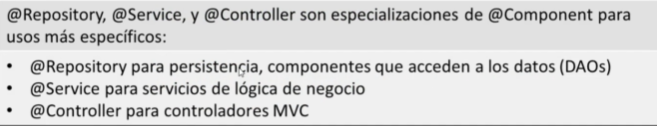
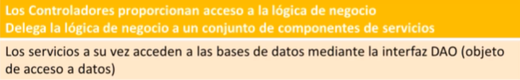

### @Component

**`@Component`** es una anotación/estereotipo genérica que marca una clase como un **bean** de Spring. Puede aplicarse a cualquier clase que deba ser gestionada por Spring, permitiendo la creación automática de instancias de esa clase cuando es necesaria.

### @SpringBootApplication 

-> Combina `@Configuration`, `@EnableAutoConfiguration` y `@ComponentScan`

- Autoconfiguración de las dependencias, thymeleaf, Data JPA, Data Mongo, DevTools, etc. 
- Component Scan:
	Escanea los componentes que tienen anotaciones, como @Controller 
	@Service
	@Repository (Acceso a datos)
	Permite hacer uso de inyección de dependencia -> inyectar o proveer una instancia de un componente Spring, pasarselo a otro componente para que lo utilice (relación de componente)

### @Controller

`@Controller` indica que una clase actúa como un controlador que maneja las solicitudes de un cliente. A diferencia de `@RestController`, que devuelve directamente los datos en formato JSON o XML, `@Controller` se utiliza junto con **motores de plantillas** como **Thymeleaf**, **JSP**, o **FreeMarker** para devolver vistas (páginas HTML) al navegador.

Controlador en el patron MVC.

Se encarga de utilizar métodos Handler -> maneja peticiones de usuario. Se procesan en el controlador y devuelve una response o respuesta (una vista, un HTML, envia un API RESTful (JSON), etc).

Sirve como una especialización de un @Component

Como funciona:
- **Mapeo de rutas**: Usa anotaciones como `@RequestMapping`, `@GetMapping`, `@PostMapping` para asociar métodos con URLs específicas.
- **Modelo de datos**: Utiliza el objeto `Model` o `ModelMap` para pasar datos a la vista.
- **Retorno de vistas**: Devuelve el nombre de la vista que debe renderizarse, generalmente un archivo HTML o JSP.

Metodos Handler -> maneja user requests:

| Anotación         | Uso                           | Tipo de Solicitud         | Concepto                                                                                                                                                                    |
| ----------------- | ----------------------------- | ------------------------- | --------------------------------------------------------------------------------------------------------------------------------------------------------------------------- |
| `@GetMapping`     | Recuperar datos o vistas      | GET                       | Lleva los datos de forma "visible" al cliente (navegador web). El medio de envío es la URL. Los datos los puede ver cualquiera.                                             |
| `@PostMapping`    | Enviar datos o crear recursos | POST                      | Consiste en datos "ocultos" (porque el cliente no los ve) enviados por un formulario cuyo método de envío es post. Es adecuado para formularios. Los datos no son visibles. |
| `@PutMapping`     | Actualizar recursos           | PUT                       |                                                                                                                                                                             |
| `@DeleteMapping`  | Eliminar recursos             | DELETE                    |                                                                                                                                                                             |
| `@RequestMapping` | Múltiples propósitos          | Específica según `method` |                                                                                                                                                                             |


### @RestController


La anotación **`@RestController`** es una especialización de **`@Controller`** en Spring Framework, pero con un enfoque específico en el desarrollo de aplicaciones RESTful. Se utiliza para **indicar que una clase es un controlador** que maneja las solicitudes HTTP y que **el cuerpo de la respuesta se debe serializar** directamente en el formato adecuado (como JSON o XML) en lugar de retornar una vista.

#### **Características principales de `@RestController`:**

1. **Combinación de `@Controller` y `@ResponseBody`:**
    
    - **`@RestController`** es una combinación de dos anotaciones: **`@Controller`** y **`@ResponseBody`**.
    - La anotación **`@Controller`** indica que la clase es un controlador en el contexto de Spring MVC.
    - La anotación **`@ResponseBody`** asegura que el valor retornado por los métodos del controlador se **escriba directamente en el cuerpo de la respuesta HTTP**, en lugar de ser resuelto como una vista.
    - Esto hace que **`@RestController`** sea la forma más conveniente de crear APIs RESTful en Spring.
2. **Respuesta en formato JSON o XML:**
    
    - En las aplicaciones REST, las respuestas son generalmente datos estructurados, como **JSON** o **XML**. Con `@RestController`, Spring automáticamente convierte los objetos retornados en JSON (o el formato configurado) usando **Jackson** o **JAXB**, sin necesidad de escribir código adicional.
3. **Métodos de controlador devuelven datos:**
    
    - Los métodos dentro de un `@RestController` no tienen que devolver vistas (como en el caso de los controladores tradicionales de Spring MVC). En cambio, retornan objetos Java que serán serializados y enviados al cliente.

La API creada con **`@RestController`** puede ser consumida por cualquier aplicación cliente que realice solicitudes HTTP. Puedes integrar este acceso en aplicaciones web, móviles o incluso desde otros servidores. Además, puedes implementar medidas de seguridad y configuraciones adicionales (como **CORS**) para gestionar el acceso y proteger la API


### @RequestMapping

La anotación **`@RequestMapping`** en **Spring** es una de las anotaciones más utilizadas y poderosas en el desarrollo de aplicaciones web con Spring MVC (Model-View-Controller). Se usa para mapear las solicitudes HTTP (GET, POST, PUT, DELETE, etc.) a los métodos específicos en los controladores, es decir, asocia una URL con un método que manejará esa solicitud.

#### **Características de `@RequestMapping`**:

- Se puede utilizar para mapear múltiples tipos de solicitudes HTTP.
- Permite configurar de manera flexible los métodos HTTP que un controlador manejará, así como las rutas de acceso y otros parámetros.
- Es la anotación base para las rutas en Spring MVC, y puede ser especializada para diferentes métodos HTTP (por ejemplo, **`@GetMapping`**, **`@PostMapping`**, etc.).

#### **Parámetros comunes de `@RequestMapping`**:

1. **`value`**: Define la ruta o las rutas que el método manejará. Es uno de los parámetros más comunes.
    
    - **Ejemplo**: `@RequestMapping(value = "/productos")`
2. **`method`**: Define el tipo de solicitud HTTP que se va a manejar (GET, POST, PUT, DELETE, etc.). Especificar el método HTTP asegura que solo las solicitudes de ese tipo sean manejadas por el método.
    
    - **Ejemplo**: `method = RequestMethod.GET`
3. **`params`**: Filtra las solicitudes según los parámetros de la URL o los parámetros de la solicitud.
    
    - **Ejemplo**: `params = "id=5"` solo respondería a solicitudes con el parámetro `id` igual a 5.
4. **`headers`**: Filtra las solicitudes según los encabezados HTTP.
    
    - **Ejemplo**: `headers = "key=valor"`
5. **`produces`**: Define el tipo de contenido que el método va a devolver (la respuesta). Por ejemplo, si se va a devolver JSON, se puede especificar `produces = "application/json"`.
    
    - **Ejemplo**: `produces = "application/json"`
6. **`consumes`**: Especifica el tipo de contenido que el método puede consumir en la solicitud. Por ejemplo, si el controlador espera datos JSON en el cuerpo de la solicitud, se puede definir `consumes = "application/json"`.
    
    - **Ejemplo**: `consumes = "application/json"`

---
### @Service
Interactuan con repositories. Logica de negocio y controlador. Metodos handler y request -> response.

Indica que la clase proporciona **lógica de negocio**. Aunque funcionalmente es igual a **`@Component`** semánticamente se usa para mejorar la legibilidad del código y seguir las buenas prácticas.
### @Repository
Datos.

Destinada a clases que acceden directamente a la base de datos o a la capa de persistencia. Además de marcar la clase como un bean, proporciona soporte para la conversión de excepciones específicas de la base de datos a **excepciones de Spring**, lo que facilita la gestión de errores. Traduce las excepciones de persistencia.



---
### @ModelAttribute

La anotación **`@ModelAttribute`** en Spring MVC se utiliza para **vincular datos de un modelo a un objeto** que puede ser usado por un controlador. Facilita la transferencia de datos desde formularios web al backend, llenando automáticamente los atributos de un objeto Java a partir de los parámetros enviados en una solicitud HTTP.

- **Vincular datos a objetos** automáticamente. (Operación POST)
- **Agregar atributos al modelo** para la vista. (Operación GET)
- **Preprocesar datos comunes** antes de manejar solicitudes.

### @RequestParam

La anotación **`@RequestParam`** en Spring MVC se utiliza para **extraer parámetros de la solicitud HTTP** (como los enviados mediante un formulario o una URL de consulta) y asignarlos a los argumentos del método del controlador. Esta anotación es útil para manejar datos simples enviados desde el cliente al servidor.

Facilita la extracción de datos de las solicitudes HTTP de manera sencilla, permitiendo definir si los parámetros son obligatorios o usar valores predeterminados para una experiencia de usuario mejorada.

- **`value/name`**: Especifica el nombre del parámetro en la solicitud.
- **`required`**: Define si el parámetro es obligatorio (por defecto es `true`).
- **`defaultValue`**: Valor por defecto si el parámetro no está presente en la solicitud.


### @RequestParam

La anotación **`@PathVariable`** en Spring MVC se utiliza para **extraer valores dinámicos de la URL** y asignarlos a los parámetros de un método del controlador. Se emplea cuando las rutas de acceso contienen identificadores o segmentos variables que deben procesarse en el servidor.


### @RequestParam vs @PathVariable

| **Característica**      | **`@RequestParam`**                                                                              | **`@PathVariable`**                                                                  |
| ----------------------- | ------------------------------------------------------------------------------------------------ | ------------------------------------------------------------------------------------ |
| **Origen de los datos** | Extrae datos de los **parámetros de consulta** o **formulario** en la solicitud HTTP.            | Extrae valores directamente de la **ruta de la URL**.                                |
| **Formato de URL**      | `http://example.com/producto?categoria=libros&id=10`                                             | `http://example.com/producto/libros/10`                                              |
| **Sintaxis**            | `@RequestParam("nombre")`                                                                        | `@PathVariable("nombre")`                                                            |
| **Ubicación en la URL** | Se utiliza con parámetros de tipo `key=value` en la **query string** (`?key=value&key2=value2`). | Se usa con partes dinámicas de la **ruta definida en la URL** (`/ruta/{variable}`).  |
| **Obligatoriedad**      | Es obligatorio por defecto, pero se puede hacer opcional con `required = false`.                 | Es obligatorio siempre que esté definido en la ruta del `@GetMapping` o similar.     |
| **Valores por defecto** | Se puede definir un **valor por defecto** con `defaultValue`.                                    | No admite valores por defecto, ya que siempre debe coincidir con la ruta.            |
| **Usos Comunes**        | Formularios web, parámetros de búsqueda o filtros.                                               | Identificadores de recursos (RESTful APIs), rutas específicas como `/usuarios/{id}`. |


### @RequestBody 

La anotación **`@RequestBody`** en Spring MVC se utiliza para vincular automáticamente el cuerpo (Body) de una solicitud HTTP a un objeto Java. Es común en APIs RESTful cuando los datos de la solicitud se envían en formato **JSON** o **XML** y necesitan deserializarse para ser procesados.

---

#### **Funcionamiento**

- Lee el cuerpo de la solicitud HTTP.
- Convierte el contenido (por ejemplo, JSON) en una instancia de una clase Java utilizando un convertidor de mensajes (como `MappingJackson2HttpMessageConverter` para JSON).
- Vincula los datos deserializados al parámetro del método.

### @Value

La anotación **`@Value`** en Spring Framework se utiliza para inyectar valores en campos, métodos o constructores de un componente. Los valores pueden provenir de **archivos de propiedades**, **expresiones de entorno**, o **constantes literales**, proporcionando una forma flexible de configurar aplicaciones.

### @PropertySource

La anotación **`@PropertySource`** en Spring Framework se utiliza para **cargar propiedades desde un archivo de propiedades externo** y ponerlas a disposición en el contexto de la aplicación. Permite utilizar archivos `.properties` para configurar valores que pueden ser inyectados en los beans utilizando `@Value`.


``` Java
@PropertySource({"classpath:config.properties", "classpath:otra-config.properties"})

@PropertySources({
@PropertySource,
@PropertySource })
```
 
### @Configuration

La anotación `@Configuration` en Spring se utiliza para marcar una clase como una **fuente de definiciones de beans** para el contenedor de Inversión de Control (IoC). Las clases anotadas con `@Configuration` se encargan de definir cómo se crean y configuran los objetos (beans) que Spring debe gestionar.

---
### **Características de `@Configuration`**

1. Es parte del paquete `org.springframework.context.annotation`.
2. Se utiliza en combinación con la anotación `@Bean` para definir métodos que producen y devuelven instancias de beans gestionadas por el contenedor.
3. Actúa como un reemplazo de los archivos de configuración XML en Spring.

### @Bean

Juega el mismo papel que anotar la clase con @Component. Pero en este caso, se crea el componente desde un método que alberga la clase anotada como @Configuration
### @Autowired

La anotación **`@Autowired`** en Spring Framework se utiliza para realizar la **inyección automática de dependencias**. Permite que Spring resuelva e inyecte automáticamente un bean en un punto específico, como un campo, un constructor o un método de un componente.

Inyectar un bean de Spring en un componente actual. Por defecto, falla si no encuentra candidatos disponibles.

### Donde se puede inyectar
* Atributos
* Metodos Setter
* Constructor


### @Qualifier & @Primary

En Spring, las anotaciones `@Primary` y `@Qualifier` se utilizan para manejar la **resolución de ambigüedad de beans** cuando hay varias definiciones disponibles para la misma interfaz o tipo de dependencia. Ayudan a especificar cuál debe usarse en cada caso.

---

La anotación `@Primary` indica que un bean específico debe ser el **predeterminado** cuando existen múltiples beans del mismo tipo disponibles para la inyección. Se utiliza a nivel de clase o método de configuración.

La anotación `@Qualifier` permite especificar exactamente qué bean se debe inyectar cuando hay múltiples candidatos. Se puede usar junto con `@Autowired` o `@Inject`.

---
### **Diferencias entre @Primary y @Qualifier**

| **Aspecto**      | **@Primary**                                                    | **@Qualifier**                                   |     |
| ---------------- | --------------------------------------------------------------- | ------------------------------------------------ | --- |
| **Propósito**    | Define un bean predeterminado para la inyección.                | Especifica un bean por su nombre o calificativo. |     |
| **Nivel de uso** | Se coloca en la definición de un bean (`@Component` o `@Bean`). | Se coloca en la inyección de dependencias.       |     |
| **Aplicación**   | A nivel global, cuando hay varias definiciones.                 | A nivel de inyección específica.                 |     |

### @PostConstruct y @PreDestroy

Las anotaciones `@PostConstruct` y `@PreDestroy` son parte de **Java EE** (ahora Jakarta EE) y **Spring Framework**, utilizadas para realizar tareas de inicialización y limpieza en los ciclos de vida de los beans gestionados.

### **@PostConstruct**

Se usa para anotar un método que debe ejecutarse después de que se haya creado una instancia del bean y se hayan inyectado todas sus dependencias, pero antes de que el bean esté disponible para su uso.
#### Características:

- Solo puede haber un método anotado con `@PostConstruct`.
- Se ejecuta una vez después de la inyección de dependencias.
- No debe tener parámetros.
- Usado para **inicializar recursos** o realizar configuraciones.

### **@PreDestroy**

Se usa para anotar un método que debe ejecutarse justo antes de que el bean sea destruido, lo que permite realizar tareas de limpieza.

#### Características:

- Solo puede haber un método anotado con `@PreDestroy`.
- Se ejecuta una vez, justo antes de que el bean sea eliminado.
- No debe tener parámetros.
- Usado para **liberar recursos** o cerrar conexiones.

## *MANEJO DE EXCEPCIONES*
### @ControllerAdvice

- Se utiliza para manejar excepciones globalmente en **controladores anotados con `@Controller`**.
- Se combina con métodos anotados con `@ExceptionHandler`, `@ModelAttribute`, o `@InitBinder` para proporcionar lógica transversal.
- Los métodos manejan respuestas que típicamente retornan **vistas** en aplicaciones web tradicionales.

### @RestControllerAdvice

- Es una especialización de `@ControllerAdvice` que combina su funcionalidad con `@ResponseBody`.
- Se utiliza para manejar excepciones globalmente en **controladores REST anotados con `@RestController`**.
- Los métodos anotados con `@ExceptionHandler` dentro de `@RestControllerAdvice` devuelven respuestas directamente en formato JSON o XML.

### @ResponseStatus

La anotación `@ResponseStatus` en **Spring Framework** se utiliza para definir el **código de estado HTTP** que debe devolverse cuando un método de controlador o una excepción específica es manejada. Permite simplificar la gestión de códigos de estado sin la necesidad de usar explícitamente `ResponseEntity` en todos los métodos.


### @Transactional (Para operaciones con la BD)

La anotación `@Transactional` en **Spring** se usa para **manejar transacciones** de manera declarativa. Permite asegurar que una serie de operaciones se ejecuten de manera **atómica**, es decir, que todas se completen correctamente o, en caso de error, se reviertan.

---

#### ✅ **¿Cómo Funciona `@Transactional`?**

- Si **todas** las operaciones dentro del método anotado con `@Transactional` se ejecutan correctamente, **se confirman** (commit).
- Si ocurre una **excepción no controlada** (**unchecked**, `RuntimeException` o `Error`), **se revierte** la transacción (rollback).
- Por defecto, **Spring solo realiza rollback en excepciones no chequeadas** (`RuntimeException`).

|Configuración|Descripción|
|---|---|
|`@Transactional`|Aplica transacciones por defecto (rollback solo en unchecked exceptions).|
|`@Transactional(rollbackFor = Exception.class)`|Rollback también en checked exceptions.|
|`@Transactional(noRollbackFor = IllegalArgumentException.class)`|Evita rollback en ciertas excepciones.|
|`@Transactional(readOnly = true)`|Optimiza consultas de solo lectura.|


## @ConfigurationProperties

Anota una clase para decirle a Spring:
> “💡 Esta clase va a representar un _grupo de propiedades_ del archivo de configuración, y Spring las va a inyectar automáticamente en sus atributos.”

###### ✅ ¿Por qué usar `@ConfigurationProperties`?

| Ventaja                                | Detalle                                       |
| -------------------------------------- | --------------------------------------------- |
| ✅ Agrupa varias propiedades            | Muy útil para configurar módulos o servicios  |
| ✅ Es fuertemente tipado                | Spring verifica que los tipos coincidan       |
| ✅ Soporta propiedades anidadas, listas | Ideal para estructuras complejas              |
| ✅ Reutilizable en múltiples lugares    | Podés inyectarla donde quieras                |
| ✅ Separación de lógica y config        | Mejora la limpieza y mantenimiento del código |
### 🆚 @Value`?

- `@Value("${clave}")` es para **propiedades sueltas**.

- `@ConfigurationProperties` es ideal para **estructuras completas**, listas, objetos anidados, etc.

### ⚙️ Como instalar esta cfg

1. Anotar la clase con `@Component` o registrarla con `@EnableConfigurationProperties`.
    
2. Tener getters y setters públicos (Spring los necesita para inyectar).
    
3. Tener un `prefix` que coincida con la raíz de tus propiedades.

4. @EnableConfigurationProperties(Clase.class) en la clase a ser inyectada las propiedades.
