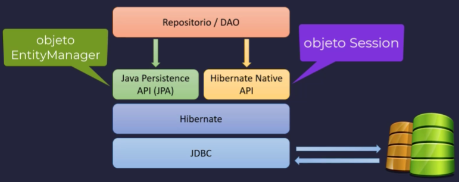

Hibernate es un framework de persistencia de datos para Java que facilita la interacción con bases de datos relacionales utilizando el paradigma de objetos (ORM - Object Relational Mapping).


### 🔹 **Características Principales de Hibernate**

1. **ORM (Object-Relational Mapping)**: Convierte automáticamente objetos Java en registros de base de datos y viceversa.
2. **Soporte para múltiples bases de datos**: Compatible con MySQL, PostgreSQL, Oracle, SQL Server, entre otras.
3. **Transparencia en la gestión de transacciones**: Manejo eficiente de transacciones con ACID.
4. **Uso de HQL (Hibernate Query Language)**: Permite consultas más flexibles que SQL estándar.
5. **Soporte para caché**: Mejora el rendimiento evitando consultas innecesarias a la base de datos.
6. **Generación automática de esquemas**: Puede crear, actualizar o validar esquemas de bases de datos.

## 🔹Tipos de consultas

### HQL / JPQL

 Son similares a SQL pero trabajan con entidades en lugar de tablas.

```java
import jakarta.persistence.*;
import java.util.List;

@Repository
public class UsuarioRepository {
    @PersistenceContext
    private EntityManager entityManager;

    public List<Usuario> obtenerUsuariosPorNombre(String nombre) {
        String hql = "SELECT u FROM Usuario u WHERE u.nombre = :nombre";
        return entityManager.createQuery(hql, Usuario.class)
                            .setParameter("nombre", nombre)
                            .getResultList();
    }
}
```

🔹 **Ventajas**:
- Usa nombres de entidades y atributos en lugar de nombres de tabla/columna.
- Independiente del motor de base de datos.

### CRITERIA API

Es un enfoque basado en programación que permite construir consultas de manera dinámica y segura.

```Java

import jakarta.persistence.criteria.*;

public List<Usuario> obtenerUsuariosPorEdad(int edad) {
    CriteriaBuilder cb = entityManager.getCriteriaBuilder();
    CriteriaQuery<Usuario> query = cb.createQuery(Usuario.class);
    Root<Usuario> root = query.from(Usuario.class);

    query.select(root).where(cb.equal(root.get("edad"), edad));

    return entityManager.createQuery(query).getResultList();
}
```

🔹 **Ventajas**:

- Ideal para construir consultas dinámicas.
- Evita problemas de SQL Injection al usar métodos tipados.

### SQL Nativo

Permite ejecutar consultas SQL directamente sobre la base de datos.

```Java
public List<Usuario> obtenerUsuariosActivos() {
    String sql = "SELECT * FROM usuarios WHERE activo = 1";
    return entityManager.createNativeQuery(sql, Usuario.class).getResultList();
}
```

🔹 **Ventajas**:

- Permite aprovechar características específicas del motor de base de datos.
- Más eficiente en ciertos casos.

---

## ✅ **Comparación de Métodos**

| Método           | Uso recomendado                      | Facilidad de uso | Seguridad              |
| ---------------- | ------------------------------------ | ---------------- | ---------------------- |
| **HQL/JPQL**     | Consultas comunes y simples          | ✅ Fácil          | ✅ Seguro               |
| **Criteria API** | Consultas dinámicas y tipadas        | ❌ Más complejo   | ✅ Más seguro           |
| **SQL Nativo**   | Consultas avanzadas con optimización | ✅ Flexible       | ❌ Puede ser vulnerable |
